# Manual de Usuario Global de Instalaciones

## 1. Finalidad del manual

Este manual explica cómo funciona una instalación dentro de Allplan desde el punto de vista del usuario.

Se ha tomado la instalación de Agua como ejemplo, pero el funcionamiento general es común al resto de instalaciones. Lo que cambia entre unas y otras son algunos elementos concretos, ciertos nombres de layer y algunos atributos, pero la forma de trabajar es prácticamente la misma.

El objetivo de este documento es que cualquier usuario pueda entender:

- cómo empezar una instalación;
- cómo dibujarla;
- cómo editarla;
- cómo aplicar layers y atributos;
- cómo insertar elementos definidos, macros y soportes;
- cómo funcionan las copias o duplicados;
- y qué comprobaciones conviene hacer antes de finalizar.

## 2. A quién va dirigido

Este manual está pensado para usuarios que necesiten modelar instalaciones en Allplan y entender el comportamiento general de la herramienta, sin entrar en detalles de programación ni en nombres internos del sistema.

## 3. Cómo se complementa este manual

Este documento se organiza en dos grandes bloques:

1. El funcionamiento global de las instalaciones.
2. Las particularidades de cada instalación.

En la primera parte se explica la lógica de uso común a todos los sistemas.

En la segunda parte se recogen las diferencias específicas de cada instalación, por ejemplo:

- los tipos de instalación disponibles;
- las distribuciones admitidas;
- los diámetros disponibles;
- los accesorios automáticos;
- los elementos definidos propios;
- las limitaciones o avisos especiales;
- y cualquier diferencia importante respecto a otras instalaciones.

De este modo, el usuario puede entender primero el funcionamiento general y después consultar, dentro del mismo manual, la unidad concreta de la instalación con la que vaya a trabajar.

Cuando aparezca el marcador **[PENDIENTE DE CONFIRMAR EN ENTORNO REAL]**, significa que ese dato todavía debe validarse en Allplan antes de cerrar la versión definitiva del manual.

## 4. Qué partes son comunes en todas las instalaciones

Todas las instalaciones comparten la misma lógica de trabajo:

1. Se selecciona el tipo de instalación.
2. Se configuran los parámetros principales en la paleta.
3. Se dibuja o edita el recorrido.
4. Se revisa la previsualización.
5. Se añaden, si hace falta, elementos definidos, macros o soportes.
6. Se aplican layers y atributos.
7. Se finaliza la creación.

Lo que cambia entre instalaciones suele ser:

- el tipo de elementos disponibles;
- los diámetros;
- las conexiones;
- algunos layers;
- y algunos atributos asociados a cada sistema.

## 5. Vista general del trabajo con una instalación

El trabajo habitual con una instalación se basa en tres ideas:

- dibujar un recorrido;
- enriquecer ese recorrido con información;
- y generar el resultado final.

En la práctica, esto significa que primero se crea el trazado principal y después se añaden o ajustan el resto de elementos necesarios.

`[[CAPTURA-01: paleta principal completa de la instalación con sus apartados visibles]]`
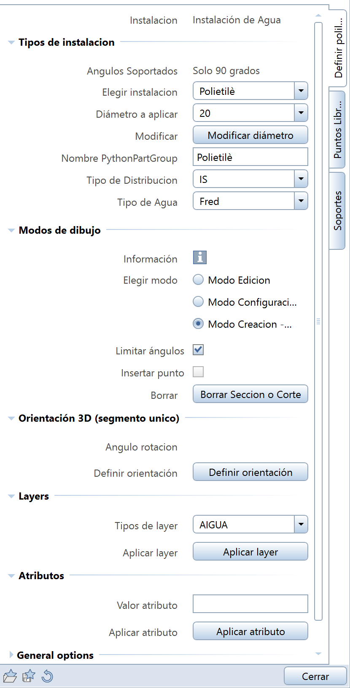

## 6. Flujo de trabajo recomendado

El orden más recomendable para trabajar es este:

1. Elegir el tipo de instalación.
2. Elegir el tipo de tubo o sistema.
3. Definir diámetro, distribución y resto de parámetros básicos.
4. Dibujar el recorrido principal.
5. Revisar uniones, codos y bifurcaciones.
6. Aplicar layers y atributos si es necesario.
7. Insertar elementos definidos, macros o soportes.
8. Comprobar que la información esté completa.
9. Pulsar el botón de finalizar.

Seguir este orden ayuda a evitar correcciones posteriores innecesarias.

## 7. Modos principales de trabajo

La herramienta suele trabajar con tres modos principales.

### 6.1. Modo creación

Es el modo que se utiliza para dibujar un recorrido nuevo.

En este modo el usuario va definiendo puntos y la instalación crea el trazado entre ellos.

### 6.2. Modo edición

Es el modo que se utiliza para corregir o modificar un recorrido ya dibujado.

En este modo se pueden seleccionar tramos, borrar partes, cambiar diámetros o ajustar la geometría.

### 6.3. Modo extender

Es el modo que se utiliza para continuar un recorrido ya existente sin empezar desde cero.

## 8. Qué debe configurar el usuario antes de dibujar

Antes de empezar a dibujar conviene revisar los campos principales de la paleta.

### 7.1. Tipo de instalación

Es el campo donde el usuario elige el sistema con el que va a trabajar.

En Agua, por ejemplo, puede elegir entre varias opciones como:

- Polietilè;
- Multicapa;
- Armaflex.

Este campo define qué geometría y qué comportamiento tendrá la instalación.

`[[CAPTURA-02: desplegable del tipo de instalación abierto con las opciones visibles]]`
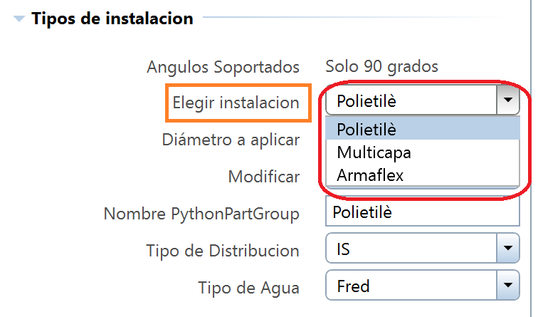

### 7.2. Diámetro

El diámetro condiciona:

- el tamaño del elemento principal;
- las piezas de conexión compatibles;
- y parte de los atributos asociados.

Antes de dibujar, conviene comprobar que el diámetro seleccionado es el correcto.

### 7.3. Distribución

La distribución define cómo debe comportarse la instalación dentro del sistema.

En Agua es habitual trabajar con modos como:

- TD;
- IS.

La distribución puede afectar a:

- la forma de los elementos;
- los atributos aplicados;
- y el comportamiento de ciertos accesorios.

### 7.4. Tipo de agua u otras variantes

Algunas instalaciones incluyen campos adicionales para distinguir variantes internas del sistema. Si la paleta muestra este dato, conviene definirlo antes de empezar.

### 7.5. Ángulos y orientación

Si la instalación trabaja con limitación angular o con orientación definida, estos parámetros deben comprobarse al inicio para evitar tener que rehacer el recorrido más adelante.

## 9. Cómo dibujar una instalación

El dibujo de la instalación se basa en una secuencia de clics que definen el recorrido.

### 8.1. Inicio del recorrido

El usuario hace clic en el primer punto del trazado.

### 8.2. Continuación del recorrido

Cada clic adicional añade un nuevo tramo.

La herramienta va construyendo la instalación entre esos puntos y mostrando una previsualización del resultado.

### 8.3. Qué ve el usuario mientras dibuja

Mientras se dibuja, la herramienta no solo muestra la línea del recorrido, sino también el comportamiento previsto de la instalación:

- tramos principales;
- cambios de dirección;
- uniones;
- bifurcaciones.

`[[CAPTURA-03: ejemplo de instalación en fase de dibujo con previsualización activa]]`
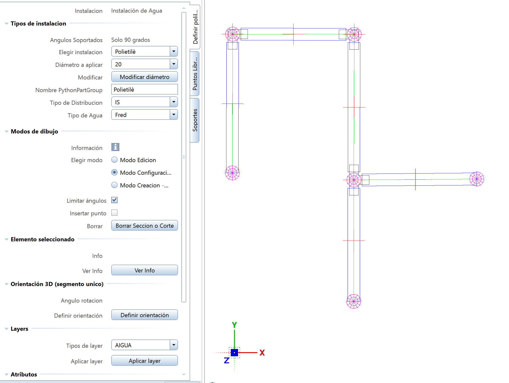

## 10. Cómo se generan automáticamente los accesorios

Una vez definido el recorrido, la herramienta interpreta la geometría y coloca automáticamente los accesorios necesarios.

### 9.1. Codos

Cuando el recorrido cambia de dirección, la herramienta genera el codo correspondiente.

### 9.2. Manguitos o uniones

Cuando dos tramos deben unirse de forma alineada, la herramienta genera la unión correspondiente.

### 9.3. Bifurcaciones o tes

Cuando un punto conecta tres direcciones, la herramienta genera la bifurcación adecuada.

### 9.4. Regla general de prioridad

Si un punto funciona como bifurcación, prevalece la bifurcación sobre otras soluciones.

Esto significa que el sistema no coloca varias piezas incompatibles en el mismo punto.

`[[CAPTURA-04: ejemplo comparativo de un codo, una unión y una bifurcación]]`
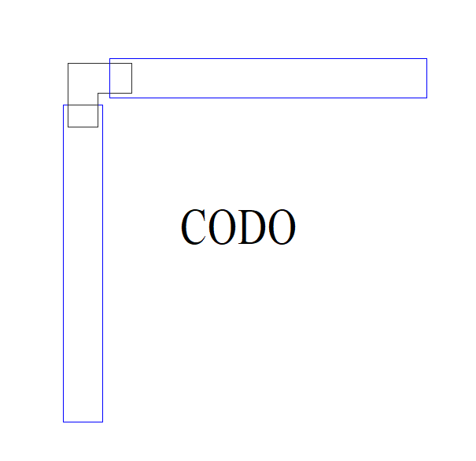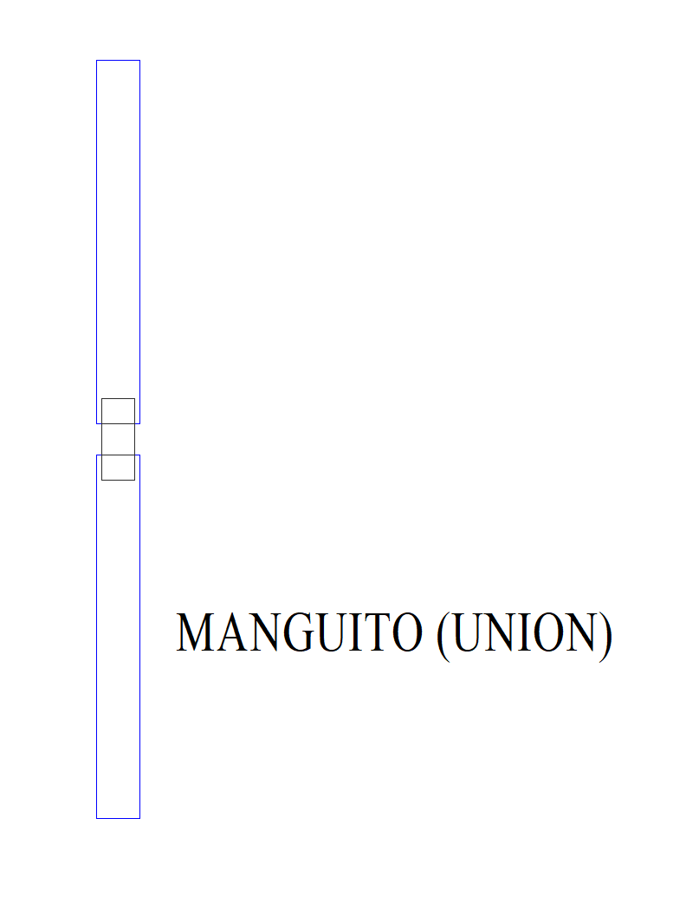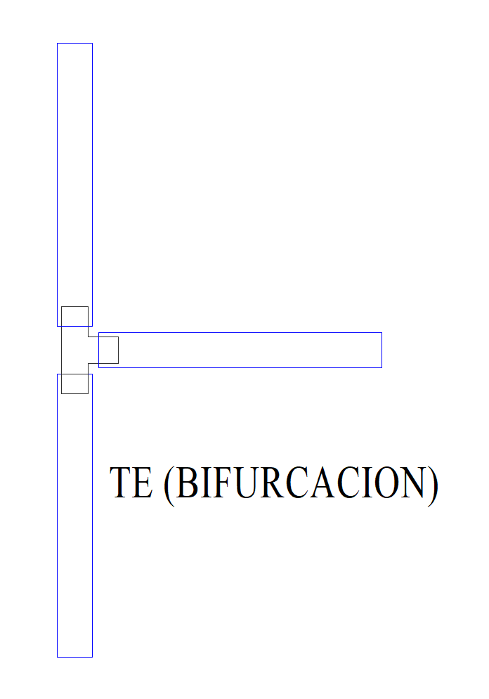

## 11. Cómo editar una instalación ya dibujada

Una vez creado el recorrido, el usuario puede modificarlo.

### 10.1. Seleccionar tramos

Se pueden seleccionar:

- tramos individuales;
- varios tramos a la vez;
- o zonas concretas del recorrido.

### 10.2. Borrar una sección

El botón de borrar elimina el tramo o la parte seleccionada.

Después del borrado, la herramienta vuelve a analizar la conexión entre los tramos que quedan y reajusta automáticamente las piezas necesarias.

### 10.3. Cambiar el diámetro

El botón de modificar diámetro actualiza el diámetro del tramo o de la selección activa.

Después del cambio, la instalación vuelve a reconstruir el resultado para adaptarlo al nuevo valor.

## 12. Layers

El usuario puede trabajar con los layers definidos por defecto o aplicar otros manualmente.

### 11.1. Layers por defecto

Cada instalación ya trae una configuración base de layers.

### 11.2. Aplicar layers manualmente

Desde la paleta, el usuario puede seleccionar un layer y aplicar ese layer a los elementos seleccionados.

Esto es útil cuando se necesita clasificar el modelo de una forma concreta antes de finalizar.

`[[CAPTURA-05: ejemplo del apartado de layers en la paleta y su aplicación sobre la instalación]]`
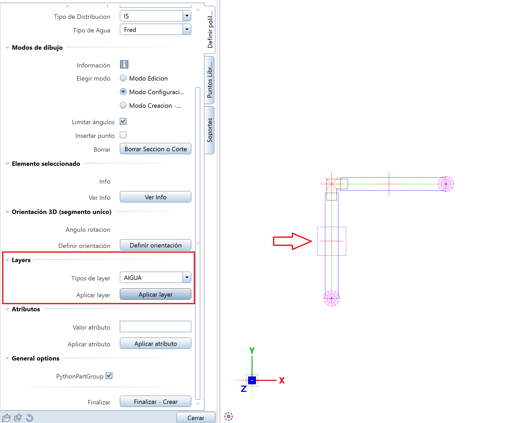

## 13. Atributos

Además de la geometría, la instalación puede llevar información adicional en forma de atributos.

### 12.1. Atributos automáticos

Parte de los atributos se asignan automáticamente según el tipo de instalación, el elemento y la configuración elegida.

### 12.2. Atributos aplicados por el usuario

La paleta también permite aplicar atributos manualmente a una selección.

Esto es útil cuando el usuario necesita completar o corregir información antes de crear el resultado final.

### 12.3. Atributo padre

En determinadas instalaciones existe un atributo principal que sirve para organizar y relacionar elementos. Este dato es importante porque también puede influir en las copias o duplicados automáticos.

## 14. Qué revisar antes de finalizar

Antes de pulsar el botón de finalizar, se recomienda comprobar:

- que el recorrido es correcto;
- que los diámetros son los adecuados;
- que los layers necesarios están aplicados;
- que los atributos importantes están informados;
- y que los elementos definidos están bien colocados.

Si falta información, la herramienta puede mostrar un aviso antes de continuar.

`[[CAPTURA-06: mensaje de aviso previo a finalizar cuando falta información]]`
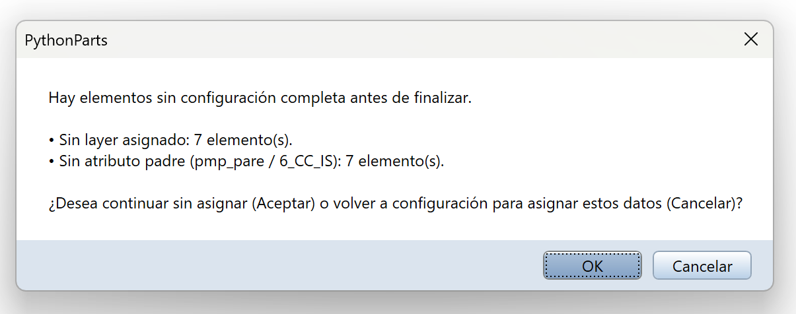

## 15. Rotación y orientación

Algunos elementos admiten rotación y orientación.

Esto se aplica especialmente a:

- elementos definidos;
- macros;
- ciertos accesorios que requieren una posición concreta.

Cuando la paleta muestra campos de rotación u orientación, el usuario puede utilizarlos para ajustar la posición final del elemento.

`[[CAPTURA-07: ejemplo de orientación o rotación aplicada a un elemento]]`
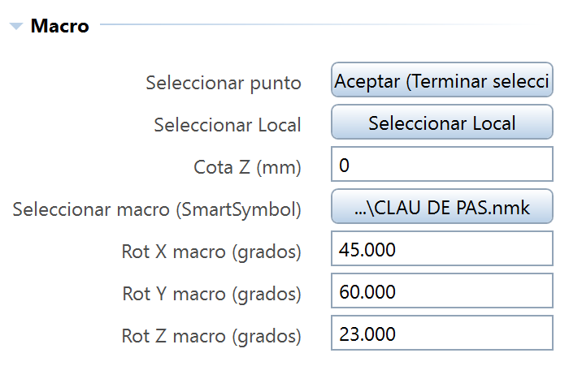

## 16. Macros

La herramienta permite colocar macros de librería dentro de la instalación.

### 15.1. Para qué sirven

Las macros permiten insertar objetos ya preparados, por ejemplo elementos de librería que deben colocarse en puntos concretos del recorrido.

### 15.2. Qué debe hacer el usuario

El flujo habitual es:

1. Elegir el tipo de macro.
2. Elegir el archivo correspondiente.
3. Elegir dónde se colocará.
4. Ajustar altura y rotación si es necesario.
5. Insertar la macro.

### 15.3. Dónde puede colocarse

La macro puede situarse:

- al inicio del recorrido;
- al final;
- o en un punto libre.

### 15.4. Altura de la macro

La altura puede definirse directamente o en relación con un local seleccionado, según el caso.

`[[CAPTURA-08: bloque de la paleta para insertar macros]]`
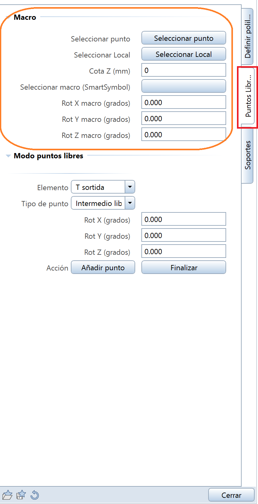

`[[CAPTURA-09: ejemplo de macro previsualizada dentro de la instalación]]`
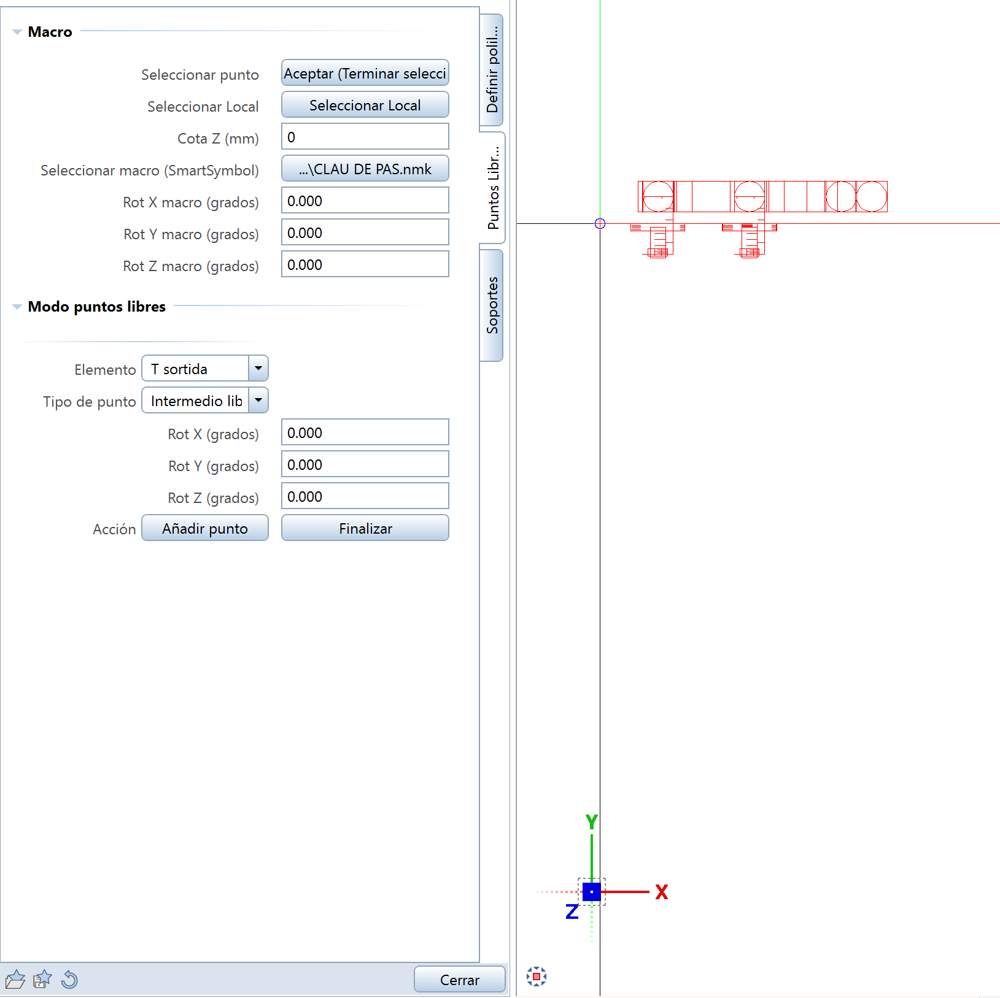

## 17. Elementos definidos

Además del recorrido principal, la herramienta permite añadir elementos definidos propios de la instalación.

En Agua, por ejemplo, pueden existir elementos como válvulas, salidas o piezas concretas del sistema.

### 16.1. Cómo se insertan

Hay dos formas habituales:

- insertarlos sobre un punto del recorrido;
- o insertarlos como punto libre.

### 16.2. Qué debe hacer el usuario

El usuario debe:

1. elegir el tipo de elemento;
2. seleccionar el punto de inserción;
3. ajustar rotación o altura si hace falta;
4. confirmar la colocación.

`[[CAPTURA-10: bloque de la paleta para insertar Elementos Definidos]]`
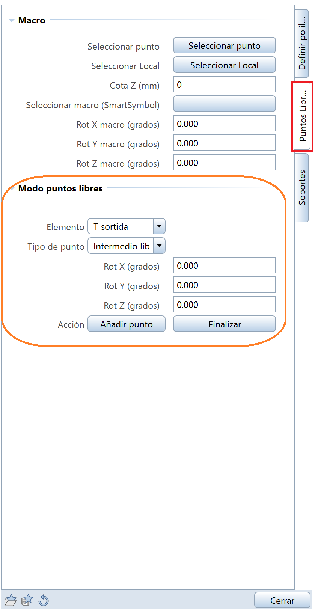

`[[CAPTURA-11: inserción de un elemento especial como punto libre]]`
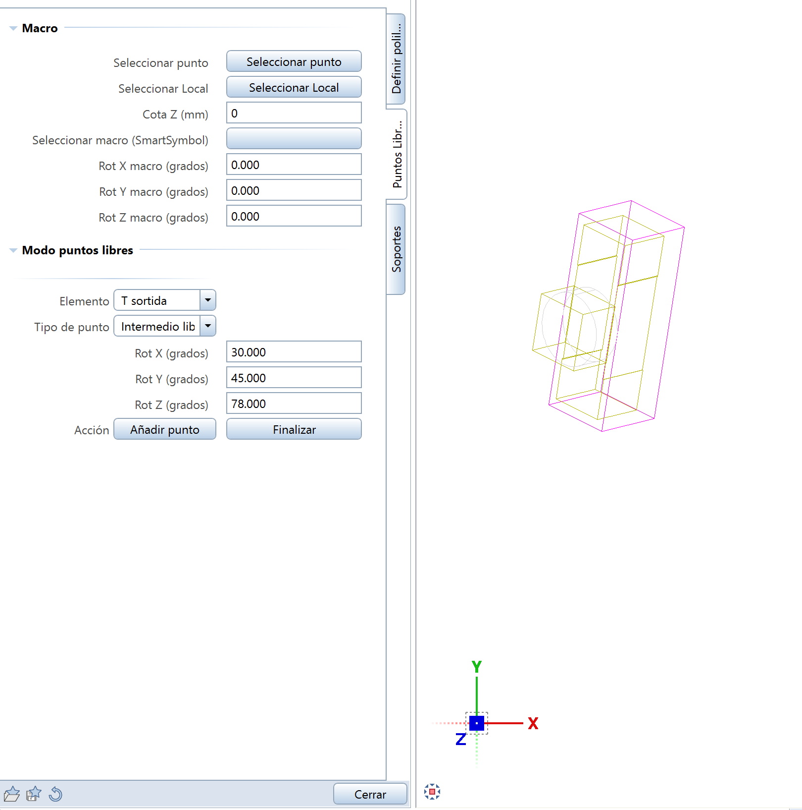

## 18. Puntos no definidos

Los puntos no definidos sirven para marcar la lógica del recorrido sin colocar todavía un elemento final.

Son útiles para describir:

- inicios;
- finales;
- intermedios;
- bifurcaciones;
- conexiones entre caminos.

### 17.1. Para qué sirven

Ayudan a organizar recorridos complejos y a definir la intención del trazado antes de convertirlo en una solución completa.

### 17.2. Puntos comunes

Si varios caminos coinciden en un punto o pasan muy cerca, la herramienta puede interpretar que existe una relación entre ellos.

Esto ayuda a construir una topología coherente.

`[[CAPTURA-12: ejemplo de puntos no definidos en distintos colores]]`

`[[CAPTURA-13: ejemplo de punto común entre dos caminos]]`

## 19. Soportes

La herramienta también permite trabajar con soportes.

### 19.1. Qué hace el usuario

El flujo habitual es:

1. configurar el soporte en la paleta;
2. elegir el tipo de soporte y revisar sus parámetros;
3. pulsar el botón para insertarlo;
4. definir su posición con los puntos necesarios;
5. revisar la previsualización;
6. acumularlo o crearlo.

Para que el soporte quede bien definido, conviene completar antes de insertarlo los campos de tipo, superficie, cotas y ángulo.

### 19.2. Tipos de soporte

De forma general, la herramienta permite trabajar con familias de soporte como:

- `Zeta`
- `Omega`
- `Cinta`

Cada una responde a una solución física distinta. Por eso, antes de colocarlo, el usuario debe elegir el tipo que corresponda al sistema y al montaje que quiere representar.

En función de la instalación, pueden aparecer variantes o subtipos asociados a cada familia.

### 19.3. Subtipo de instalación

Además del tipo de soporte, la paleta puede mostrar el campo `Subtipo instalación`.

Este campo ayuda a identificar con qué familia de instalación se relaciona el soporte. Es útil para mantener coherencia entre el soporte que se inserta y la instalación sobre la que se está trabajando.

`[[CAPTURA-14B: tipo de soporte, subtipo instalación y superficie en la paleta de soportes]]`
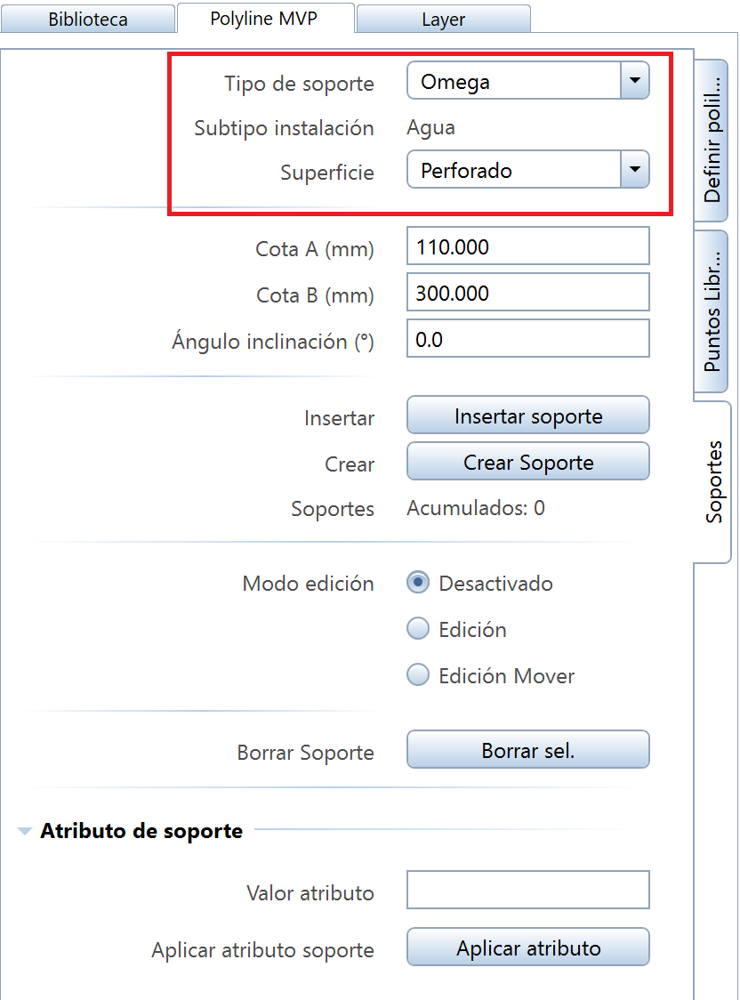

### 19.4. Superficie

El campo `Superficie` permite definir cómo debe considerarse el soporte:

- `Liso`
- `Perforado`

Esta elección forma parte de la definición final del soporte y de la información que queda asociada a él. Por eso conviene revisarla antes de insertarlo.

No todos los tipos de soporte utilizan esta distinción exactamente de la misma manera, pero para el usuario la regla práctica es sencilla: debe escoger la superficie que corresponda al soporte real que quiere representar.

### 19.5. Cota A y Cota B

Estas dos medidas son básicas para definir la geometría del soporte:

- `Cota A`: indica la altura del soporte o su desarrollo vertical.
- `Cota B`: indica el largo del soporte o su desarrollo horizontal.

En soportes con parte vertical, `Cota A` tiene un papel especialmente importante. En otros tipos, como ciertas cintas, no siempre interviene de la misma forma.

### 19.6. Ángulo de inclinación

El campo `Ángulo de inclinación` permite girar o inclinar el soporte respecto a su posición base.

Es útil cuando el soporte no debe quedar en una orientación neutra y necesita un ajuste adicional para adaptarse al montaje real.

Lo recomendable es definir primero la posición del soporte y usar después el ángulo como ajuste fino.

`[[CAPTURA-14C: ejemplo de Cota A, Cota B y ángulo de inclinación en la paleta]]`
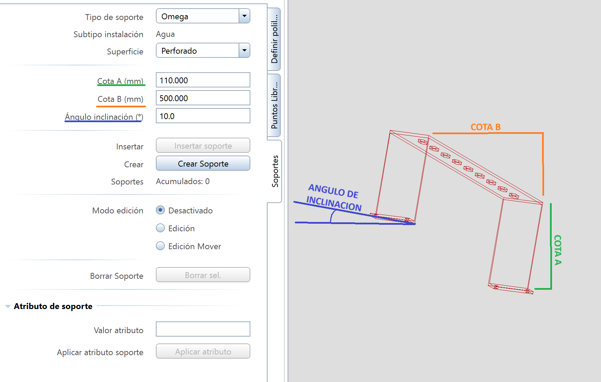

### 19.7. Modos de edición

Una vez que hay soportes acumulados, la herramienta permite trabajar con distintos modos de edición:

- `Desactivado`: la herramienta no entra en edición de soportes y los clics siguen el flujo normal de trabajo.
- `Edición`: permite seleccionar soportes para revisarlos, borrarlos o aplicarles atributos.
- `Edición Mover`: permite recolocar un soporte ya insertado o acumulado.

Estos modos son útiles cuando el recorrido principal ya está dibujado y solo falta ajustar la posición o la información de los soportes.

`[[CAPTURA-14D: modos de edición de soportes en la paleta]]`
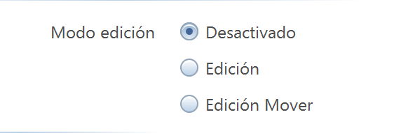

### 19.8. Atributos de soporte

La paleta también incluye un campo para aplicar el `Atributo de soporte`.

Este atributo sirve para identificar, clasificar o completar la información de los soportes antes de la creación final.

Si el usuario tiene soportes seleccionados, el atributo se aplica a esa selección. Si no hay una selección activa, la aplicación afecta a los soportes acumulados dentro de la operación en curso.

Esto resulta especialmente útil cuando se quiere dejar todos los soportes correctamente preparados antes de finalizar la instalación.

`[[CAPTURA-14E: campo de atributo de soporte y aplicación sobre soportes seleccionados o acumulados]]`
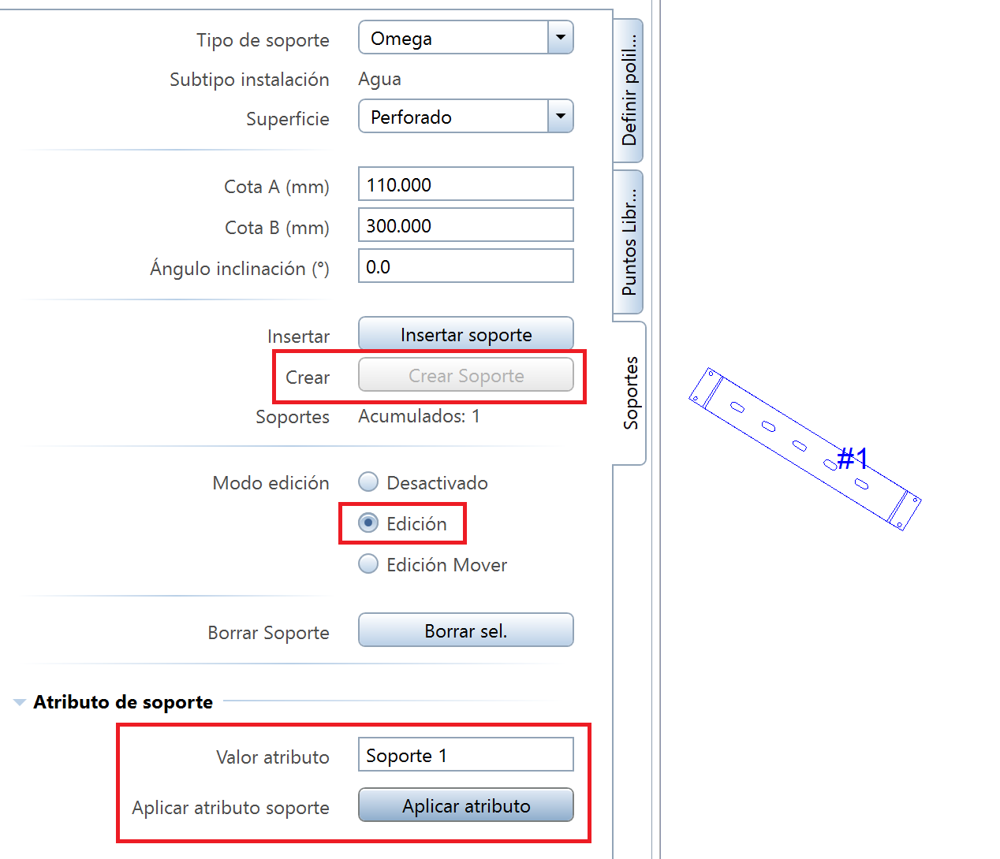

### 19.9. Cuándo conviene colocarlos

Normalmente es más cómodo colocar los soportes cuando el recorrido principal ya está bastante definido.

También conviene tener en cuenta que, antes de acumular o crear un soporte, primero debe haberse posicionado correctamente. Si todavía no se ha definido su colocación, la herramienta avisa y no lo añade.

`[[CAPTURA-14: bloque de soportes en la paleta y preview de un soporte]]`
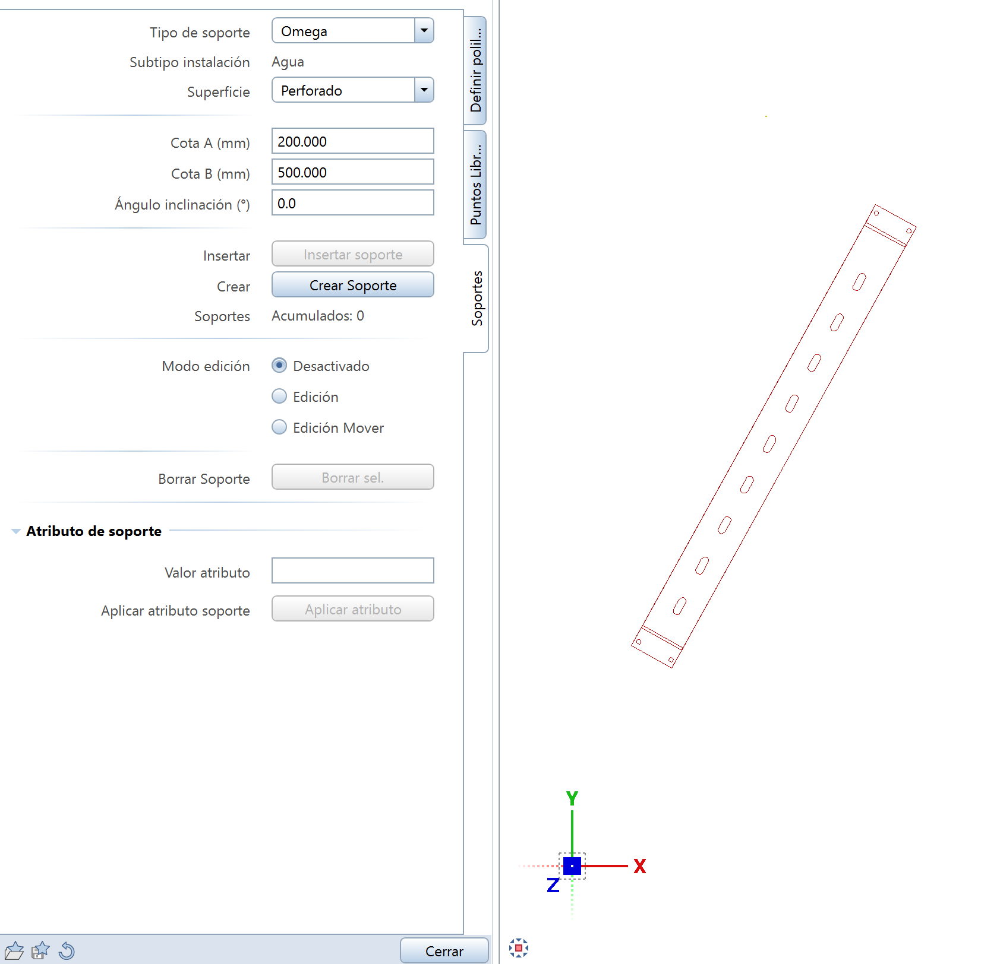

## 20. Cómo funcionan los duplicados o copias

Este punto es importante porque puede generar dudas.

### 20.1. Duplicados no deseados

La herramienta evita repetir elementos iguales cuando no corresponde.

Esto ayuda a que no aparezcan piezas duplicadas por error en el resultado final.

### 20.2. Copias intencionadas

En algunos casos, la instalación puede generar copias en otros archivos de dibujo según la información asociada al elemento.

Estas copias no son un error. Forman parte del funcionamiento previsto de la herramienta.

La lógica general es esta:

1. un elemento se crea en el archivo principal;
2. si tiene informado un atributo padre, la herramienta puede buscar otro archivo de dibujo relacionado;
3. si encuentra ese archivo entre los archivos cargados, crea allí una copia de la geometría;
4. y esa copia queda vinculada al proceso de actualización de la instalación.

### 20.3. Qué debe entender el usuario

El usuario debe saber que:

- puede existir un elemento en el archivo principal;
- y puede existir una copia relacionada en otro archivo de dibujo.

Para que esta copia funcione correctamente, deben cumplirse estas condiciones:

- el elemento debe tener informado el atributo padre correspondiente;
- el archivo de dibujo de destino debe estar cargado;
- y el nombre de ese archivo debe coincidir con la referencia que usa la instalación para localizarlo.

Si el archivo destino no está cargado o no coincide con esa referencia, la copia no se crea.

### 20.4. Qué pasa cuando la instalación se vuelve a editar

Cuando la instalación se actualiza, esas copias también se actualizan para que no queden versiones antiguas.

Antes de generar las nuevas copias, la herramienta localiza las copias previas que había creado y las elimina de los archivos correspondientes.

Después crea la versión actualizada.

`[[CAPTURA-15: ejemplo de un elemento original y su copia relacionada en otro archivo]]`

## 21. Qué ocurre al pulsar el botón de finalizar

Cuando el usuario pulsa el botón de finalizar, la herramienta:

1. revisa la información disponible;
2. reconstruye los elementos necesarios;
3. aplica atributos y layers;
4. incorpora elementos definidos, macros o soportes;
5. crea el resultado definitivo;
6. y actualiza las copias relacionadas si las hubiera.

En ese momento la instalación pasa de estar en fase de preparación a quedar creada como resultado final en el documento.

## 22. Recomendaciones prácticas de uso

- Configurar primero el sistema antes de empezar a dibujar.
- No cambiar de criterio de diámetro continuamente durante el dibujo si no es necesario.
- Revisar la distribución antes de finalizar.
- Aplicar layers y atributos cuando el recorrido ya esté claro.
- Insertar macros y elementos definidos cuando la base principal esté estable.
- Revisar los avisos antes de aceptar la creación final.

## 23. Resumen final

La herramienta de instalaciones está pensada para que el usuario dibuje un recorrido, lo complete con la información necesaria y genere un resultado final coherente dentro de Allplan.

Aunque cada instalación tenga sus particularidades, el funcionamiento general es siempre el mismo:

- configurar;
- dibujar;
- revisar;
- completar;
- y finalizar.

Por eso, entendiendo bien el ejemplo de Agua, se entiende también el comportamiento general del resto de instalaciones.

## 24. Particularidades de cada instalación

Una vez entendido el funcionamiento general, es importante conocer las diferencias propias de cada instalación.

Estas diferencias no cambian la forma general de trabajar, pero sí modifican:

- los sistemas disponibles;
- los diámetros;
- los accesorios automáticos;
- los elementos definidos;
- y algunas reglas concretas de uso.

## 25. Instalación de Agua

En esta unidad solo se recogen las particularidades de Agua. El uso general de la herramienta ya se ha explicado en los apartados anteriores, por lo que aquí se detallan únicamente las reglas, avisos y casos propios de esta instalación.

### 25.1. Sistemas disponibles en Agua

En la instalación de Agua, el usuario puede trabajar con estos sistemas:

- Polietilè;
- Multicapa;
- Armaflex.

Cada uno de ellos pertenece a la instalación de Agua, pero representa una solución distinta dentro del modelo.

`[[CAPTURA-AGUA-01: desplegable con los sistemas disponibles en Agua]]`
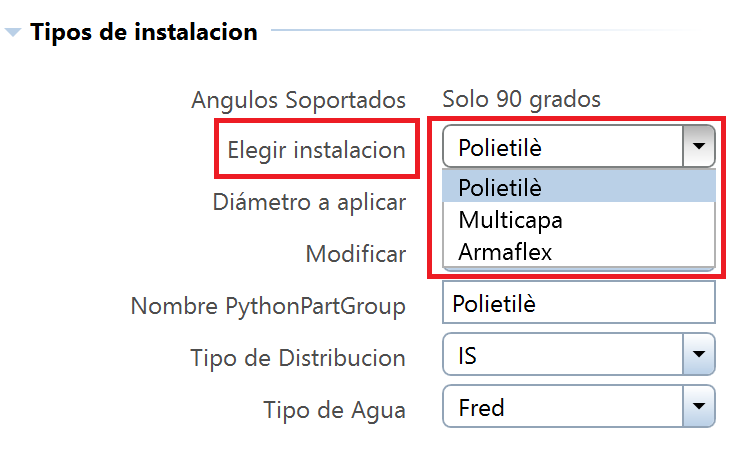

### 25.2. Distribuciones en Agua

En Agua el usuario puede trabajar con estas distribuciones:

- EN;
- TD;
- IS.

La distribución condiciona el comportamiento del sistema, los layers aplicados y el catálogo de piezas que puede resolverse automáticamente.

Cuando se selecciona la distribución `EN`, la paleta muestra además el campo `Cara (EN)`, que permite indicar si el caso corresponde a `Cara X` o `Cara Y`.

#### 25.2.1. Combinaciones que requieren atención

- Conviene elegir la distribución antes de empezar a dibujar.
- Si la distribución se cambia después, es necesario revisar de nuevo codos, uniones, bifurcaciones y layers.
- No todos los sistemas de Agua están disponibles en todas las distribuciones.

En la configuración actual:

- `Multicapa` no está disponible en `IS`.
- `Armaflex` no está disponible en `IS`.

Si el usuario intenta trabajar con alguna de esas combinaciones, la herramienta muestra un aviso indicando que ese tipo de tubo no existe o no está disponible para la distribución `IS`, y pide volver a `Modo creación`, cambiar la distribución a `TD` y regresar a `Modo configuración`.

`[[CAPTURA-AGUA-02: campo de distribución en Agua con la opción EN y el campo Cara (EN) visible]]`
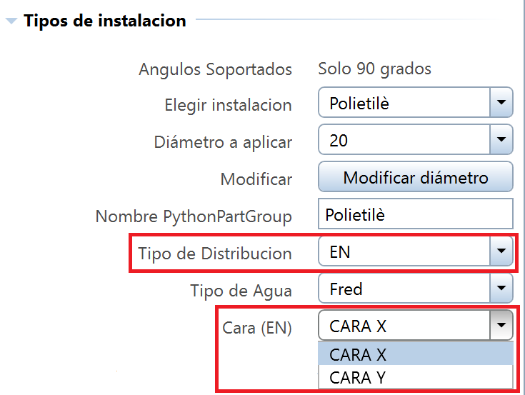

`[[CAPTURA-AGUA-03: aviso mostrado al intentar usar Multicapa o Armaflex en distribución IS]]`
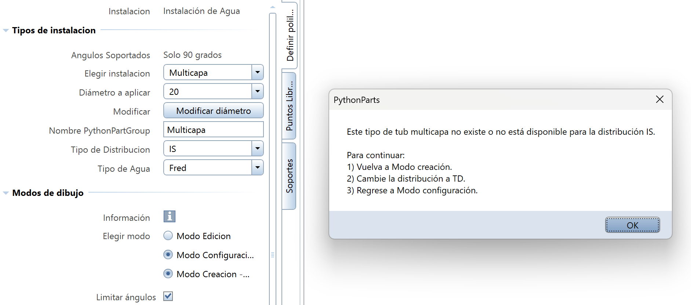

### 25.3. Diámetros y cambios de diámetro en Agua

En la instalación de Agua, los diámetros más habituales en la configuración actual son:

- 20 mm
- 25 mm

El diámetro afecta a:

- el tamaño del tubo;
- los accesorios compatibles;
- la geometría final;
- y parte de la información asociada al elemento.

#### 25.3.1. Qué ocurre al cambiar el diámetro de un tramo

Cuando se modifica el diámetro de un único tramo, la herramienta muestra una ventana de confirmación con:

- la ruta;
- el segmento;
- el diámetro anterior;
- y el nuevo diámetro.

El usuario debe confirmar el cambio antes de que la geometría se regenere.

`[[CAPTURA-AGUA-04: confirmación de cambio de diámetro sobre un único tramo]]`
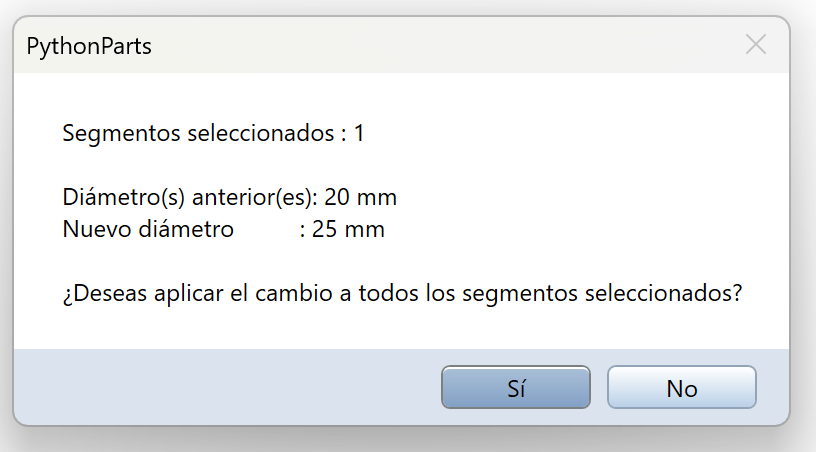

#### 25.3.2. Qué ocurre al cambiar el diámetro de varios tramos

Si hay varios tramos seleccionados, la ventana de confirmación informa de:

- cuántos segmentos se van a modificar;
- qué diámetro o diámetros tenían antes;
- y qué nuevo diámetro se va a aplicar.

Después de aceptar, la instalación reconstruye el resultado con el nuevo valor.

`[[CAPTURA-AGUA-05: confirmación de cambio de diámetro sobre varios tramos seleccionados]]`
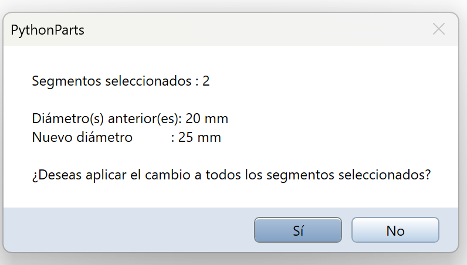

#### 25.3.3. Qué ocurre si el cambio afecta a un codo

Si el cambio de diámetro afecta a un giro resuelto con codo, no aparece un mensaje especial para el codo.

Lo que se muestra es el mensaje general de cambio de diámetro y, al aceptarlo, la herramienta recalcula el encuentro para regenerar el codo con la nueva condición.

`[[CAPTURA-AGUA-06: ejemplo de codo recalculado después de modificar el diámetro del tramo]]`

#### 25.3.4. Qué ocurre si hay dos tramos consecutivos en la misma dirección con distinto diámetro

Si dos segmentos consecutivos siguen en la misma dirección pero cambian de diámetro, la instalación no coloca un manguito normal, sino un `manguito reductor`.

Este caso es importante porque es la forma habitual de resolver una transición recta entre dos diámetros distintos.

Conviene revisarlo siempre en pantalla para comprobar que la reducción se ha generado justo en el punto esperado.

`[[CAPTURA-AGUA-07: ejemplo de manguito reductor entre dos tramos consecutivos en la misma dirección]]`
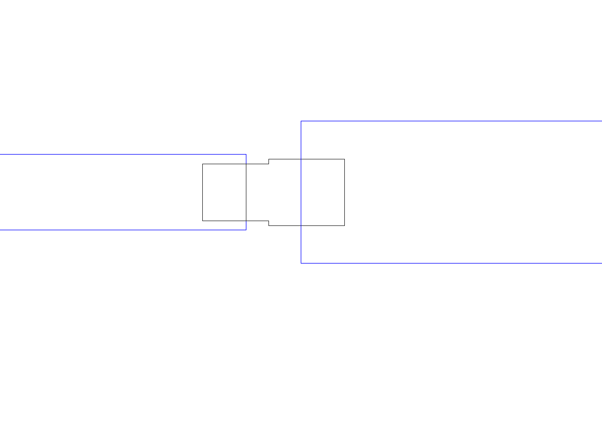

### 25.4. Accesorios automáticos en Agua

En Agua los accesorios automáticos dependen de la geometría del recorrido y de los diámetros de los tramos que se encuentran.

#### 25.4.1. Codos

En Agua la resolución automática de giros se hace con `codos de 90 grados`.

Esto significa que no debe esperarse un codo automático de `45 grados` dentro de esta instalación.

`[[CAPTURA-AGUA-08: ejemplo de codo de 90 grados generado automáticamente en Agua]]`

#### 25.4.2. Manguitos

Cuando dos tramos consecutivos están alineados y mantienen el mismo diámetro, la herramienta coloca un manguito o unión recta.

#### 25.4.3. Manguitos reductores

Cuando esos dos tramos alineados tienen distinto diámetro, la unión se resuelve mediante un manguito reductor.

Cuando el cambio de diámetro se produce en un tramo recto, esta es la solución habitual. En cambio, si el cambio aparece justo a la salida de un codo, conviene revisar el resultado porque en ese caso manda la lógica del propio giro.

#### 25.4.4. Tes o bifurcaciones

Cuando en un mismo punto confluyen tres direcciones, la instalación intenta resolver el encuentro mediante una `Te`.

En Agua conviene distinguir dos grandes familias:

- `Te iguales`, cuando las tres bocas trabajan con el mismo diámetro.
- `Te reducidas`, cuando una de las bocas trabaja con un diámetro distinto.

En la configuración actual, los casos más representativos son:

- `Te Ø20`;
- `Te Ø25`;
- `Te Ø25-20-25`;
- `Te Ø25-20-20`;
- `Te Ø25-25-20`.

Si el nodo se resuelve como `Te`, en ese mismo punto no se coloca además un codo ni un manguito.

`[[CAPTURA-AGUA-09: ejemplo comparativo de los distintos tipos de Te utilizados en Agua]]`

#### 25.4.5. Qué ocurre si no existe una Te compatible

Si la combinación de diámetros de entrada, salida y rama no tiene una `Te` disponible, la herramienta muestra un aviso indicando que no existe una `TE` para la combinación de diámetros seleccionada y pide modificar los diámetros de los segmentos para que coincidan con un tipo disponible.

`[[CAPTURA-AGUA-10: aviso mostrado cuando no existe una Te para la combinación de diámetros seleccionada]]`
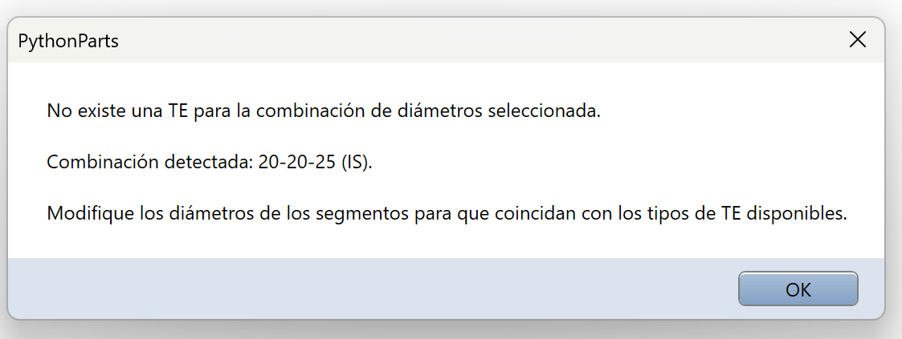

### 25.5. Longitudes mínimas y máximas de tubo en Agua

Además del sistema, la distribución y el diámetro, en Agua también hay condiciones de longitud que el usuario debe conocer.

#### 25.5.1. Longitud mínima

La longitud mínima de tramo en la configuración actual es `350 mm`.

Si el usuario dibuja un segmento más corto:

- la herramienta muestra el tipo de instalación;
- indica la longitud mínima requerida;
- indica la longitud real del tramo dibujado;
- y pregunta si se desea ignorar la restricción o cancelar para recolocar el punto.

Esto permite decidir en el momento si se mantiene ese tramo corto o si se corrige antes de seguir dibujando.

`[[CAPTURA-AGUA-11: aviso de longitud mínima no cumplida al dibujar un tramo demasiado corto]]`
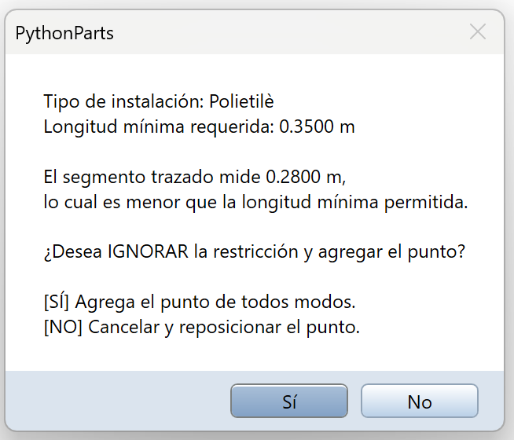

#### 25.5.2. Longitud máxima

La longitud máxima de referencia en Agua es `5,00 m`.

Si un tramo supera esa longitud, la herramienta no muestra un aviso bloqueante, sino que divide automáticamente ese tramo en subtramos más cortos para poder resolver la instalación dentro del límite permitido.

Por eso, cuando se trabaja con recorridos largos, conviene revisar el resultado para comprobar dónde se han producido los cortes y cómo han quedado las uniones generadas.

`[[CAPTURA-AGUA-12: ejemplo de tramo largo dividido automáticamente al superar la longitud máxima]]`
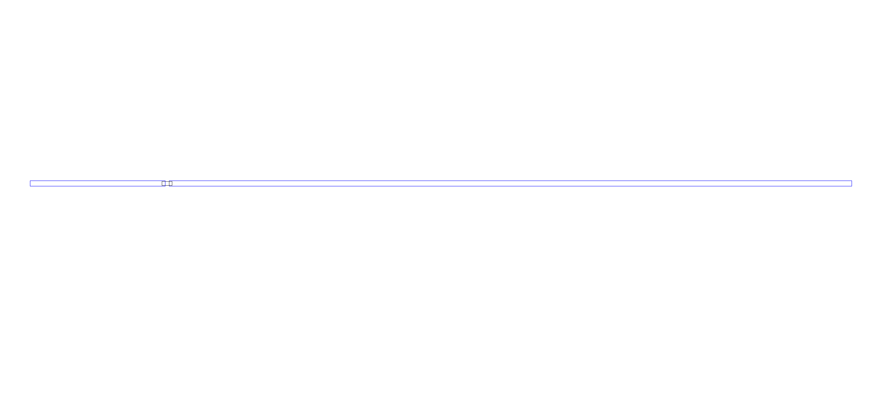

### 25.6. Layers y atributo padre en Agua

En Agua hay dos temas que conviene entender juntos:

- los `layers` de la instalación;
- y el valor que se aplica como `atributo padre`.

#### 25.6.1. Layers propios de Agua

En la configuración actual, Agua trabaja con una base de layers como:

- `AIGUA`
- `AIGUA CARA X`
- `AIGUA CARA Y`
- `IS CON AIGUA FAB`
- `IS CON AIGUA OBR`

Además, la instalación parte de un layer por defecto para la geometría principal y de un layer específico para la polilínea de eje cuando esta se genera como apoyo.

Por eso, aunque el usuario vea solo un desplegable de layers en la paleta, detrás hay una lógica propia de Agua que conviene respetar.

`[[CAPTURA-AGUA-17: desplegable de layers de Agua mostrando las opciones disponibles en paleta]]`
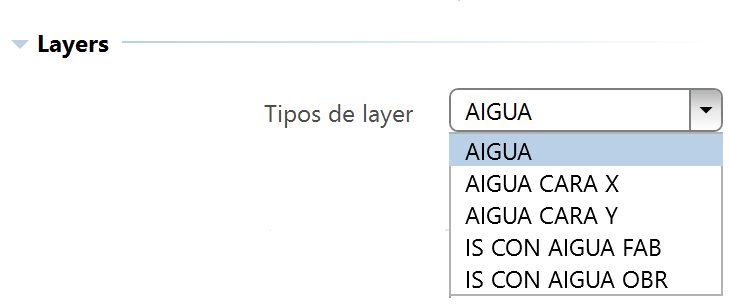

#### 25.6.2. Qué debe entender el usuario sobre los layers en Agua

Si el usuario no aplica un layer manualmente, la instalación utiliza su configuración por defecto.

Si el usuario selecciona elementos y usa `Aplicar layer`, esa asignación queda guardada para esos elementos y se utiliza al crear el resultado final.

Esto es especialmente importante en Agua cuando:

- se quiere distinguir fabricación y obra;
- se necesita separar `Cara X` y `Cara Y`;
- o se quiere corregir la clasificación de un tramo o accesorio antes de finalizar.

En general, después de cambiar distribución, geometría o selección de elementos, conviene revisar también los layers.

#### 25.6.3. Casos en los que conviene revisar el layer final

En Agua hay piezas, sobre todo en algunos casos `TD`, en las que la geometría puede resolverse con varias partes y no siempre interesa forzar todas ellas con el mismo criterio visual.

Por eso, si después de aplicar un layer el usuario ve una pieza que no responde exactamente como esperaba, conviene revisar el resultado final en pantalla en lugar de asumir que se trata de un error.

La regla práctica para el manual es esta:

- el layer aplicado desde paleta manda en el flujo habitual;
- pero algunas piezas técnicas pueden conservar parte de su lógica propia de modelo.

`[[CAPTURA-AGUA-18: ejemplo de layer aplicado en Agua sobre tramos o accesorios seleccionados]]`

#### 25.6.4. Qué es el atributo padre en Agua

En Agua, el `Valor atributo` que el usuario aplica desde la paleta no es solo una etiqueta descriptiva.

Ese valor se utiliza como `atributo padre`, que sirve para:

- identificar elementos que pertenecen a una misma referencia;
- organizar la instalación;
- y validar que la información esté completa antes de finalizar.

En Agua, la lógica es esta:

- en `TD`, el valor aplicado se utiliza como `pmp_pare`;
- en `IS`, ese mismo valor se utiliza como `pmp_pare` y también como `6_CC_IS`.

Es decir, el usuario escribe un único valor, pero la instalación lo reutiliza según la distribución activa.

#### 25.6.5. Cómo aplica el usuario el atributo padre

El flujo práctico es:

1. seleccionar el tramo o los elementos que deban compartir referencia;
2. escribir el valor en el campo `Valor atributo`;
3. pulsar `Aplicar atributo`.

Cuando se hace esto, la herramienta confirma que los atributos han sido aplicados y guarda esa información para la creación final.

Si el usuario no asigna layer o atributo padre a ciertos elementos, antes de finalizar puede aparecer un aviso indicando que hay elementos sin configuración completa.

`[[CAPTURA-AGUA-19: aplicación de Valor atributo en Agua y aviso de elementos sin layer o sin atributo padre]]`
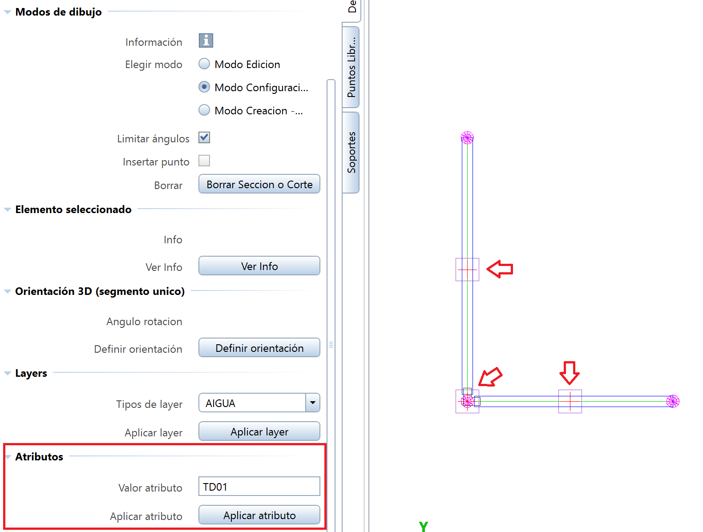

La mecánica de copia a otros archivos es común al sistema y se explica en el apartado global `20. Cómo funcionan los duplicados o copias`.

### 25.7. Elementos definidos propios de Agua

Además del trazado automático, Agua permite insertar elementos definidos propios del sistema.

En la configuración actual, Agua trabaja con elementos definidos como:

- Colze Base;
- Clau de Pas;
- Taps;
- T sortida.

Estos elementos se utilizan para completar la instalación con piezas concretas del sistema una vez que el recorrido principal ya está claro.

Además, algunos de estos elementos pueden mostrar un aviso si se intentan colocar en una distribución no admitida, especialmente en `IS`.

`[[CAPTURA-AGUA-13: paleta de Elementos Definidos en Agua con los tipos disponibles]]`
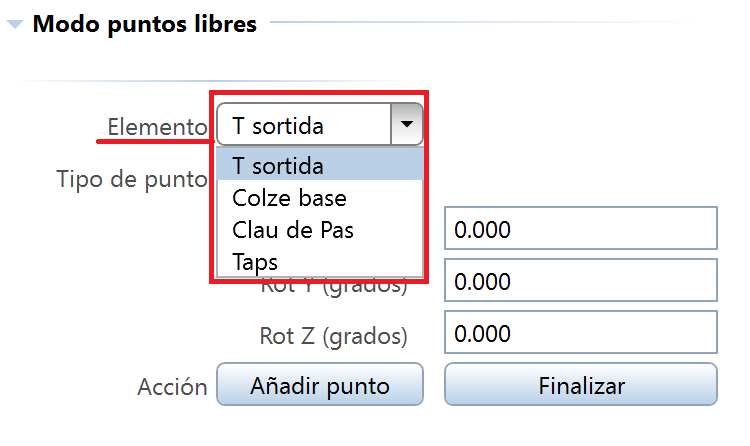

#### 25.7.1. Tipo de punto en Elementos Definidos

Además de elegir el elemento, en Agua es importante revisar el campo `Tipo de punto`, porque no todos los elementos pueden colocarse en cualquier posición de la instalación.

En la configuración actual, la relación es esta:

- `Colze base`: `Inicio` o `Final`.
- `Taps`: `Inicio` o `Final`.
- `T sortida`: `Intermedio ordenado` o `Intermedio libre`.
- `Clau de Pas`: `Intermedio ordenado` o `Intermedio libre`.

`[[CAPTURA-AGUA-13B: campo Tipo de punto en Elementos Definidos mostrando las opciones según el elemento seleccionado]]`

#### 25.7.2. Qué significa cada tipo de punto

- `Inicio`: el elemento se coloca en el arranque de la polilínea o del recorrido correspondiente.
- `Final`: el elemento se coloca en el extremo final del recorrido.
- `Intermedio ordenado`: el elemento se coloca en una posición intermedia asociada al orden del recorrido.
- `Intermedio libre`: el elemento se coloca en un punto intermedio elegido libremente por el usuario.

En otras palabras, `Inicio` y `Final` se usan para piezas que deben rematar o arrancar el recorrido, mientras que los tipos `Intermedio` se usan para piezas que deben quedar dentro del desarrollo de la instalación.

#### 25.7.3. Qué debe tener en cuenta el usuario

- Si el elemento es de `Inicio/Final`, no debe intentarse como punto intermedio.
- Si el elemento es intermedio, no debe intentarse como arranque o remate del recorrido.
- Cuando la combinación no es válida, la herramienta avisa y no permite continuar con esa colocación.

Esto es especialmente importante en Agua porque el tipo de punto forma parte de la lógica de colocación del elemento, no es solo una etiqueta descriptiva.

### 25.8. Soportes en Agua

Además de las reglas comunes de soportes, en Agua hay particularidades de clasificación y de geometría que conviene revisar.

#### 25.8.1. Qué hace especial a los soportes de Agua

En Agua no basta con fijarse en la forma del soporte. También hay que comprobar cómo queda asociado dentro de la instalación.

Esto es importante porque algunos soportes comparten familia geométrica con otras instalaciones. El caso más claro es `Omega`, ya que Agua y Saneamiento pueden trabajar con la misma base de soporte tipo `Varifix`.

Por eso, antes de insertar, conviene revisar que el campo `Subtipo instalación` quede realmente asociado a `Agua`. Si aparece otro subtipo, el soporte puede quedar clasificado como perteneciente a otra instalación aunque visualmente se parezca.

La confirmación previa a la inserción es un buen momento para comprobar `Tipo`, `Subtipo instalación`, `Superficie`, `Cota A`, `Cota B` y `Ángulo de inclinación` antes de continuar.

`[[CAPTURA-AGUA-14: soporte de Agua con Subtipo instalación Agua visible en la paleta y en la confirmación previa a insertar]]`

#### 25.8.2. Tipos de soporte más representativos en Agua

En la configuración actual, los casos más representativos en Agua son:

- `Omega`, cuando se trabaja con la lógica de soporte `Varifix`.
- `Zeta`, cuando se necesita un soporte lineal o un soporte con desarrollo vertical.
- `Cinta`, cuando se resuelve el soporte mediante cinta.

La diferencia en Agua no depende solo de la forma. También depende de cómo quede clasificado el soporte dentro de la instalación.

#### 25.8.3. Cotas que cambian el resultado en Agua

En Agua, las cotas no son un detalle menor, porque cambian directamente el tipo de resultado que se obtiene:

- en `Omega` asociado a Agua, `Cota A` y `Cota B` deben ser mayores que `0`;
- en `Zeta`, `Cota B` debe ser mayor que `0`;
- en `Zeta`, si `Cota A = 0 mm`, el soporte se resuelve como variante lineal `0 mm`;
- en `Zeta`, si `Cota A` es mayor que `0 mm`, el soporte pasa a una variante con desarrollo vertical;
- en `Cinta`, la medida decisiva es `Cota B`, que también debe estar informada.

Esto conviene revisarlo siempre en previsualización, porque un mismo tipo de soporte puede dar un resultado muy distinto solo por cambiar las cotas.

`[[CAPTURA-AGUA-15: comparación en Agua entre un soporte Zeta con Cota A igual a 0 mm y otro con Cota A mayor que 0 mm]]`
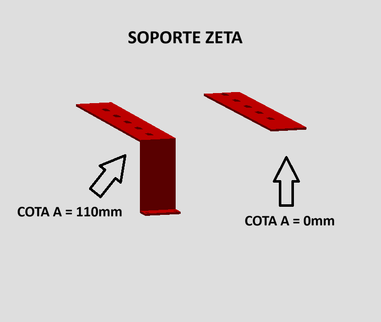

#### 25.8.4. Layers e identificación de soporte en Agua

Cuando el soporte queda correctamente asociado a Agua, la clasificación habitual de salida es:

- layer `IS_SUPORTS_AIGUA`;
- o `IS_SUPORTS_AGUA`, si el proyecto usa esa nomenclatura;
- denominación de soporte `SUPORT AIGUA`.

En cambio, el `Zeta 0 mm` mantiene su condición de soporte lineal y conserva la lógica de layer lineal general, en lugar de pasar al layer específico de Agua.

Esto es importante porque permite distinguir entre:

- soportes de Agua ya clasificados como parte de esa instalación;
- y soportes lineales genéricos que no deben interpretarse igual.

`[[CAPTURA-AGUA-16: propiedades finales de un soporte de Agua mostrando su layer e identificación]]`
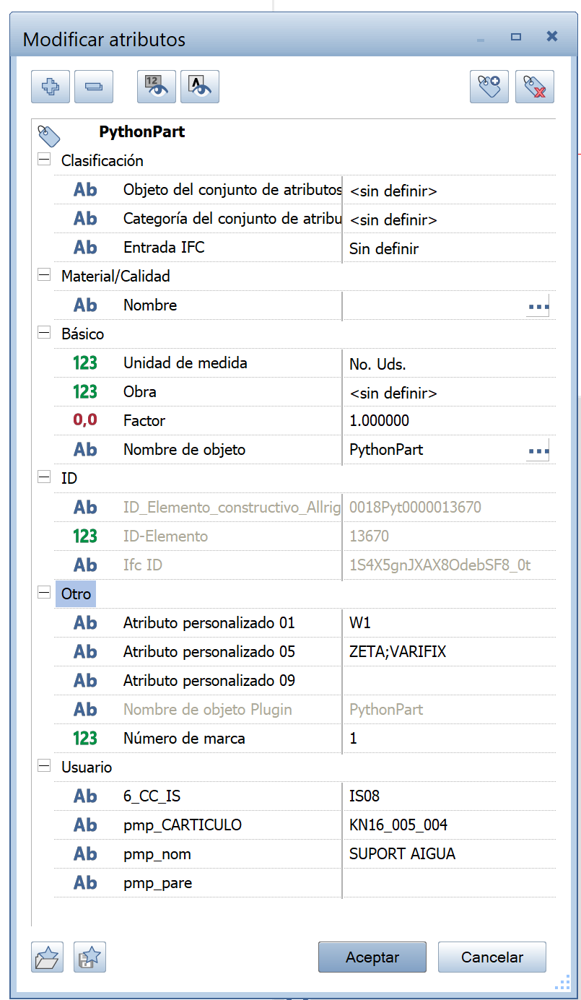

#### 25.8.5. Atributos de soporte en Agua

En Agua, el `Atributo de soporte` no solo sirve para etiquetar visualmente el soporte. También ayuda a dejarlo correctamente identificado dentro de la instalación.

Si el flujo del proyecto utiliza organización por atributo padre, conviene revisar este valor antes de finalizar, porque puede influir en cómo se organiza el soporte dentro de la instalación.

Por eso, cuando los soportes formen parte de una misma sectorización o deban seguir la misma lógica que la instalación principal, es recomendable aplicar ese atributo antes de cerrar el trabajo.

#### 25.8.6. Qué conviene revisar antes de acumular o finalizar soportes en Agua

- que `Subtipo instalación` sea realmente `Agua`;
- que un `Omega` no se haya quedado clasificado como otra instalación que use la misma familia de soporte;
- que `Cota A` y `Cota B` correspondan al tipo de soporte elegido;
- que un `Zeta 0 mm` no se haya usado por error cuando se necesitaba un soporte con desarrollo vertical;
- que el layer y la identificación final del soporte sean los esperados;
- y que el `Atributo de soporte` esté informado si el proyecto necesita clasificación por atributo.

### 25.9. Puntos a revisar con especial atención en Agua

Antes de finalizar una instalación de Agua conviene revisar especialmente:

- que el sistema seleccionado sea realmente `Polietilè`, `Multicapa` o `Armaflex`, según el caso;
- que la distribución sea la correcta y, si procede, que `Cara (EN)` también esté bien definida;
- que después de un cambio de diámetro se hayan regenerado correctamente codos, manguitos reductores y Tes, especialmente si la reducción aparece justo después de un codo;
- que los giros del recorrido respondan a la lógica de `90 grados`;
- que los avisos de longitud mínima se hayan resuelto conscientemente;
- que los layers de Agua se correspondan con el criterio de trabajo que se necesita en ese plano;
- que el atributo padre se haya aplicado realmente a los elementos que deben compartir referencia;
- que los soportes de Agua hayan quedado asociados al subtipo correcto, con sus cotas y layers bien resueltos;
- y que los recorridos largos no hayan generado divisiones automáticas en puntos no deseados.

## 26. Instalación de Saneamiento

En esta unidad solo se recogen las particularidades de Saneamiento. El uso general de la herramienta ya se ha explicado en los apartados anteriores, por lo que aquí se detallan únicamente las reglas, avisos y casos propios de esta instalación.

### 26.1. Sistemas disponibles en Saneamiento

En la instalación de Saneamiento, el usuario puede trabajar con estos sistemas:

- Pluvial;
- Fecal.

La diferencia práctica entre ambos no está solo en el nombre del sistema, sino también en el catálogo de diámetros que puede utilizarse.

En la configuración actual:

- `Pluvial` trabaja con una configuración más limitada de diámetro;
- `Fecal` permite más opciones.

Cuando el usuario cambia de sistema, la herramienta adapta automáticamente el comportamiento del trazado y los elementos que se colocan sobre él.

`[[CAPTURA-SANEAMIENTO-01: paleta de Saneamiento con los sistemas Pluvial y Fecal visibles]]`

### 26.2. Distribuciones en Saneamiento

En la configuración actual, Saneamiento no utiliza la distribución como un parámetro práctico de trabajo para el usuario.

Por eso, a diferencia de Agua, aquí no hace falta documentar combinaciones especiales de distribución. Para el uso diario, lo importante es revisar el sistema activo, el diámetro y el sentido del trazado.

### 26.3. Diámetros y cambios de diámetro en Saneamiento

En Saneamiento, el diámetro disponible depende del sistema seleccionado.

#### 26.3.1. Diámetros por sistema

En la configuración actual:

- `Pluvial`: `110 mm`;
- `Fecal`: `25 mm`, `40 mm` y `110 mm`.

Esto significa que, antes de dibujar o de modificar un tramo, conviene comprobar primero qué sistema está activo.

`[[CAPTURA-SANEAMIENTO-02: selector de diámetro en Saneamiento con las opciones visibles para Fecal]]`

#### 26.3.2. Qué ocurre al cambiar el diámetro de un tramo

Cuando el usuario modifica el diámetro de un tramo:

- se actualiza ese tramo;
- se recalculan automáticamente las uniones cercanas;
- y se regeneran los accesorios afectados en esa zona.

Por eso, después de un cambio de diámetro conviene revisar el resultado local, no solo el tramo modificado.

`[[CAPTURA-SANEAMIENTO-03: acción Modificar diámetro aplicada sobre un tramo de Saneamiento]]`

#### 26.3.3. Qué ocurre si hay dos tramos consecutivos en línea recta con distinto diámetro

Si dos tramos consecutivos siguen en línea recta pero cambian de diámetro, la herramienta coloca automáticamente una unión de transición o reducción.

Este es el caso habitual para resolver una transición recta entre dos diámetros distintos.

`[[CAPTURA-SANEAMIENTO-04: transición automática de diámetro entre dos tramos rectos consecutivos]]`

#### 26.3.4. Qué ocurre si el cambio de diámetro afecta a un codo

Si el cambio de diámetro afecta a un giro, la herramienta recalcula el codo y reajusta la unión de la zona afectada.

Cuando antes y después del giro aparecen diámetros distintos, conviene revisar en pantalla cómo ha quedado resuelto el encuentro, porque el resultado final depende de la combinación entre el giro y la transición de diámetro.

#### 26.3.5. Qué ocurre si el cambio de diámetro afecta a una bifurcación

Si el cambio de diámetro afecta a una bifurcación, la herramienta intenta colocar la pieza compatible con la combinación detectada.

Si no existe una combinación válida, aparece un aviso como este:

`No existe una TE para la combinación de diámetros seleccionada.`

`Combinación detectada: ...`

`Modifique los diámetros de los segmentos para que coincidan con los tipos de TE disponibles.`

En ese caso, el usuario debe revisar los diámetros de la entrada, la salida y la rama hasta encajar con una combinación disponible.

`[[CAPTURA-SANEAMIENTO-07: aviso mostrado cuando no existe una bifurcación compatible en Saneamiento]]`

### 26.4. Accesorios automáticos en Saneamiento

En Saneamiento, los accesorios automáticos dependen de la geometría del recorrido, del diámetro de los tramos y también del sentido del trazado.

#### 26.4.1. Codos

En Saneamiento la resolución automática de giros puede hacerse con:

- `codos de 45 grados`;
- `codos de 90 grados`.

Esto la diferencia claramente de Agua, donde el comportamiento habitual documentado es el codo de `90 grados`.

`[[CAPTURA-SANEAMIENTO-05: ejemplo comparativo de un codo de 45 grados y un codo de 90 grados en Saneamiento]]`

#### 26.4.2. Uniones y reducciones

Cuando dos tramos consecutivos están alineados:

- si mantienen el mismo diámetro, la herramienta coloca una unión;
- si cambian de diámetro, la unión se resuelve mediante una transición o reducción.

Este comportamiento debe revisarse especialmente después de modificar el diámetro de un tramo ya dibujado.

#### 26.4.3. Bifurcaciones

Cuando en un mismo punto confluyen tres direcciones, la instalación intenta resolver el encuentro con la bifurcación compatible.

En la información recibida para Saneamiento se indica el uso de bifurcaciones tipo `Y` y de algunas bifurcaciones de transición en casos concretos.

`[[CAPTURA-SANEAMIENTO-06: ejemplo de bifurcación válida en Saneamiento]]`

#### 26.4.4. Qué ocurre si no existe una bifurcación compatible

No todas las combinaciones de diámetro están disponibles en bifurcación.

Cuando no existe una pieza compatible, la herramienta muestra el aviso correspondiente y el usuario debe corregir los diámetros hasta adaptarlos a una combinación admitida.

### 26.5. Reglas geométricas y validaciones en Saneamiento

Además del sistema y del diámetro, en Saneamiento hay reglas geométricas que conviene tener presentes.

#### 26.5.1. Longitud mínima

La longitud mínima de tramo indicada para Saneamiento es `350 mm`.

Si el usuario dibuja un tramo por debajo de ese valor, el resultado puede no resolverse correctamente.

**[PENDIENTE DE CONFIRMAR EN ENTORNO REAL]** El mensaje exacto de esa validación debe confirmarse en Allplan antes del cierre definitivo del manual.

#### 26.5.2. Longitud máxima

**[PENDIENTE DE CONFIRMAR EN ENTORNO REAL]** La longitud máxima de tramo en Saneamiento debe confirmarse en Allplan.

Por eso, antes de cerrar la versión final de esta unidad conviene validar en entorno real:

- si existe un límite máximo;
- qué ocurre cuando se supera;
- y si aparece o no un aviso específico.

#### 26.5.3. Ajustes automáticos y sentido del trazado

En Saneamiento, la herramienta recorta automáticamente algunos extremos de tramo para poder encajar los accesorios.

Además, el sentido del trazado influye en el resultado de determinadas piezas. Por eso, el usuario no debe fijarse solo en la geometría, sino también en la dirección en la que se ha construido el recorrido.

Esto es importante porque existe la acción `Invertir caval`, que permite cambiar el sentido de la instalación cuando el resultado geométrico no es el esperado.

`[[CAPTURA-SANEAMIENTO-13: botón Invertir caval con mensaje de confirmación en Saneamiento]]`

### 26.6. Layers, atributos y comportamiento visual en Saneamiento

En Saneamiento conviene revisar tres cosas:

- los layers aplicados;
- los atributos aplicados sobre la selección;
- y ciertos casos de superposición visual que no deben confundirse con una copia errónea.

#### 26.6.1. Layers que conviene revisar

En la información recibida aparecen como layers importantes:

- `IS CON SANE FAB`;
- `IS CON SANE OBR`.

**[PENDIENTE DE CONFIRMAR EN ENTORNO REAL]** También se mencionan otros layers de proyecto que conviene validar en Allplan antes de cerrar definitivamente esta unidad del manual.

`[[CAPTURA-SANEAMIENTO-11: aplicación de layer sobre tramos o accesorios de Saneamiento]]`

#### 26.6.2. Atributos que conviene revisar

Los atributos más relevantes en la información recibida son:

- el valor de atributo aplicado sobre elementos seleccionados;
- y los atributos de soporte aplicados desde la página específica de soportes.

**[PENDIENTE DE CONFIRMAR EN ENTORNO REAL]** Los atributos padre o campos críticos de Saneamiento todavía deben confirmarse.

`[[CAPTURA-SANEAMIENTO-12: aplicación de atributo sobre elementos seleccionados en Saneamiento]]`

#### 26.6.3. Superposiciones que no deben confundirse con duplicados

En algunos casos, Saneamiento puede generar elementos superpuestos como parte del propio resultado gráfico o constructivo.

Esto puede parecer un duplicado, pero no debe interpretarse automáticamente como una copia entre archivos. Según la información recibida, en esta instalación puede formar parte de la definición prevista de ciertos elementos.

La mecánica de copia a otros archivos, cuando exista, sigue siendo un comportamiento global del sistema y se explica en el apartado `20. Cómo funcionan los duplicados o copias`.

### 26.7. Elementos definidos propios de Saneamiento

En la información recibida para Saneamiento aparece, como elemento definido principal:

- `Caixa Connexions 200`.

Su función es insertar un elemento de conexión o registro sobre un punto de la instalación.

Suele ser útil:

- en puntos de inicio;
- en puntos finales;
- y en puntos intermedios donde se necesite resolver una conexión o un registro.

`[[CAPTURA-SANEAMIENTO-08: uso de Caixa Connexions 200 en Saneamiento]]`

#### 26.7.1. Tipos de punto admitidos

Según la información recibida, `Caixa Connexions 200` admite:

- `Inicio`;
- `Final`;
- `Intermedio ordenado`;
- `Intermedio libre`.

En paleta, la opción intermedia puede aparecer como `Intermedio o libre`.

**[PENDIENTE DE CONFIRMAR EN ENTORNO REAL]** El mensaje exacto mostrado cuando se intenta usar un tipo de punto no válido todavía debe confirmarse.

### 26.8. Macros en Saneamiento

Saneamiento incluye una página propia para el uso de macros.

En la información recibida, el flujo específico se apoya en:

- selección del punto de inserción;
- definición de la cota;
- y ajuste de altura respecto al piso cuando procede.

**[PENDIENTE DE CONFIRMAR EN ENTORNO REAL]** Los detalles exactos de orientación todavía deben confirmarse en Allplan.

`[[CAPTURA-SANEAMIENTO-09: página de macros de Saneamiento con selección de punto de inserción]]`

### 26.9. Soportes en Saneamiento

Saneamiento dispone también de una página específica de soportes.

Según la información recibida:

- el tipo `Zeta` aparece como valor visible por defecto;
- las superficies habituales son `Liso` y `Perforado`;
- y el flujo de trabajo incluye inserción, creación y edición desde la misma paleta.

También conviene revisar:

- `Cota A`;
- `Cota B`;
- y `Ángulo de inclinación`.

**[PENDIENTE DE CONFIRMAR EN ENTORNO REAL]** El listado completo de tipos de soporte de Saneamiento todavía debe confirmarse.

`[[CAPTURA-SANEAMIENTO-10: página de soportes de Saneamiento con inserción y edición]]`

### 26.10. Mensajes y avisos propios de Saneamiento

En la información recibida aparecen como mensajes relevantes:

- `No hay instalación guardada para invertir.`
  Aparece al intentar invertir una instalación sin trazado guardado.
- `Instalación invertida: ahora va de final a inicio.`
  Aparece cuando la inversión se realiza correctamente.
- `No se pudo invertir la instalación: ...`
  Aparece cuando la inversión falla y conviene revisar el trazado.
- `No existe una TE para la combinación de diámetros seleccionada...`
  Aparece cuando no existe una bifurcación compatible con los diámetros detectados.
- `caval sin sentido sera creado`
  Aparece en casos concretos relacionados con la orientación de la bifurcación.

**[PENDIENTE DE CONFIRMAR EN ENTORNO REAL]** Conviene validar estos mensajes en Allplan antes del cierre definitivo del manual, especialmente si alguno de ellos se ha abreviado en la información inicial.

### 26.11. Puntos a revisar con especial atención en Saneamiento

Antes de finalizar una instalación de Saneamiento conviene revisar especialmente:

- que el sistema activo sea realmente `Pluvial` o `Fecal`;
- que el diámetro elegido sea compatible con ese sistema;
- que los cambios de diámetro hayan regenerado correctamente uniones, reducciones, codos y bifurcaciones;
- que una bifurcación no haya quedado en una combinación no válida;
- que los giros se estén resolviendo con el ángulo esperado, especialmente en casos de `45 grados` y `90 grados`;
- que los avisos de longitud mínima se hayan resuelto conscientemente;
- que el sentido del trazado sea el correcto antes de usar `Invertir caval`;
- que los layers y atributos aplicados respondan al criterio del plano;
- que `Caixa Connexions 200` esté colocada con el tipo de punto adecuado;
- y que los soportes se hayan revisado con sus cotas, superficie y tipo correctos.

## 27. Próximas unidades por instalación

Este mismo esquema puede repetirse dentro del manual para el resto de instalaciones, por ejemplo:

- Ventilación;
- Electricidad;
- y otras instalaciones futuras.

La idea es que cada una tenga su propia unidad específica dentro del mismo manual, manteniendo una estructura común para que la consulta sea sencilla.
